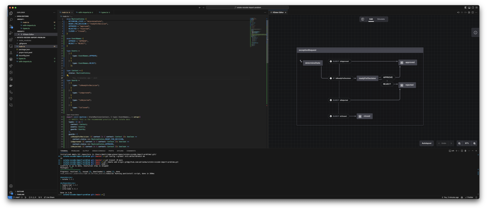

# VSCode plugin not resolving imports

This repo demonstrates an issue with the xstate VSCode plugin where it doesn't resolve imports, which breaks state chart visualization.

There are two files:

## without-imports.ts

[This file](./without-imports.ts) declares enums locally. It works perfectly in the visualizer:

## with-imports.ts

[This file](./with-imports.ts) imports enums from [types.ts](./types.ts). In the visualizer, it shows almost nothing:

